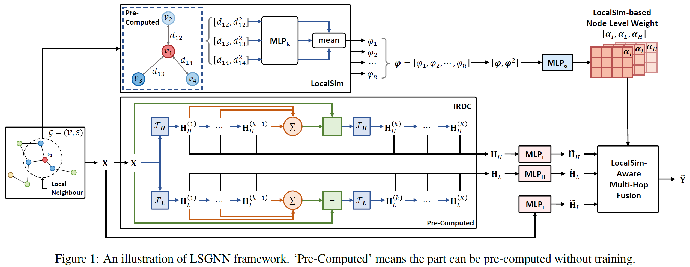
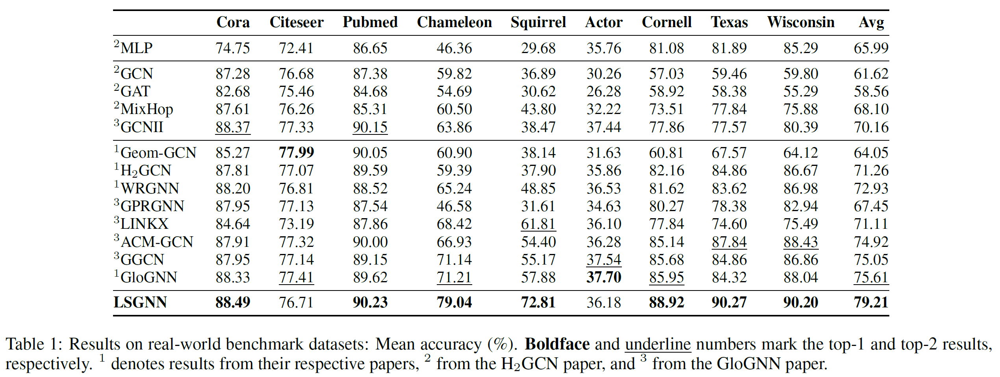
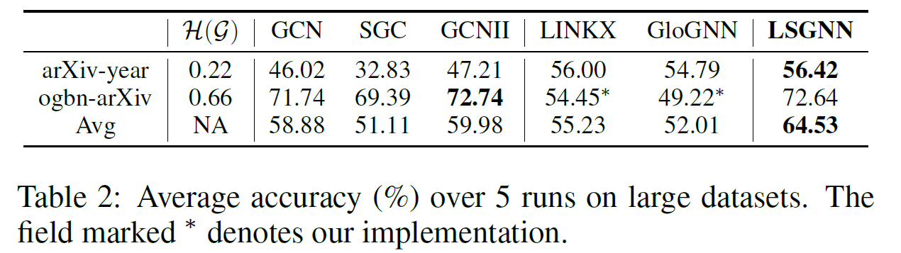

# LSGNN: Towards General Graph Neural Network in Node Classification by Local Similarity
Official Implementation for the IJCAI2023 paper, *LSGNN: Towards General Graph Neural Network in Node Classification by Local Similarity*, [[arxiv]](https://arxiv.org/abs/2305.04225), by Yuhan Chen*, Yihong Luo*, Jing Tang, Liang Yang, Siya Qiu, Chuan Wang, Xiaochun Cao. (* means equal contribtuion)

## Update (2024-11-05)
We update the code for LSGNN (in `v2/`) and the old version is put in `v1/`. We also release our hyper-parameters settings in `LSGNN_v2/log/`. 

Note that you may not obtain the same result as those on our paper, since the performance are sensitive to device and package versions, etc. We recommande you to conduct hyper-parameters search by your own (e.g., use Optuna).

## 1. Introduction

Heterophily has been considered as an issue that hurts the performance of Graph Neural Networks (GNNs). To address this issue, some existing work uses a graph-level weighted fusion of the information of multi-hop neighbors to include more nodes with homophily. However, the heterophily might differ among nodes, which requires to consider the local topology. Motivated by it, we propose to use the local similarity (LocalSim) to learn node-level weighted fusion, which can also serve as a plug-and-play module. For better fusion, we propose a novel and efficient Initial Residual Difference Connection (IRDC) to extract more informative multi-hop information. Moreover, we provide theoretical analysis on the effectiveness of LocalSim representing node homophily on synthetic graphs. Extensive evaluations over real benchmark datasets show that our proposed method, namely Local Similarity Graph Neural Network (LSGNN), can offer comparable or superior state-of-the-art performance on both homophilic and heterophilic graphs. Meanwhile, the plug-and-play model can significantly boost the performance of existing GNNs.

### 1.1 Framework



### 1.2 Evaluations on Small Graphs



### 1.3 Evaluations on Large Graphs



## 2. Requirements

```
torch
torch-geometric
ogb
```

## 3. Dataset Download
Run ```utils.py``` to download all the datasets first.

## 4. Train Model
You can run ```train.py``` to train **LSGNN** in default settings on ```Cora```. 

Or run:

```
$ python train.py --dataset cora
```

You can modify the hyper-parameters settings in ```config.py```.

## 5. Contact

Please contact **Yuhan Chen** (draym@qq.com or draym28@gmail.com) or **Yihong Luo** (yluocg@connect.ust.hk) if you have any question about this code.
